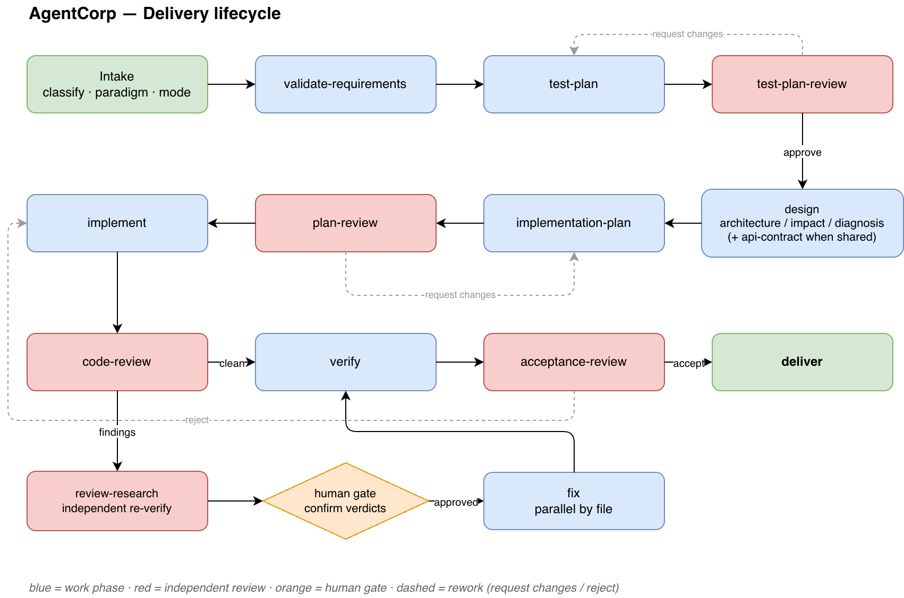
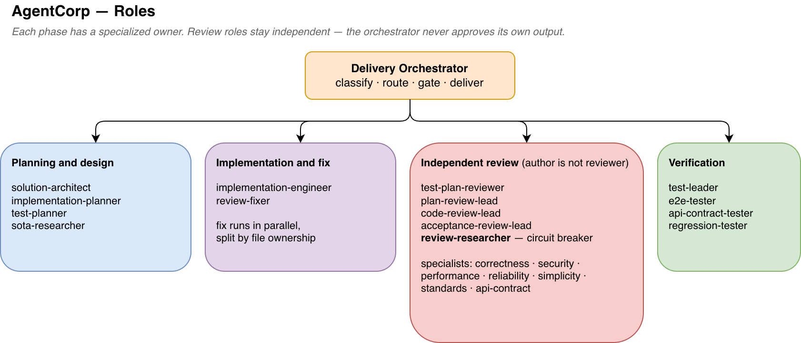
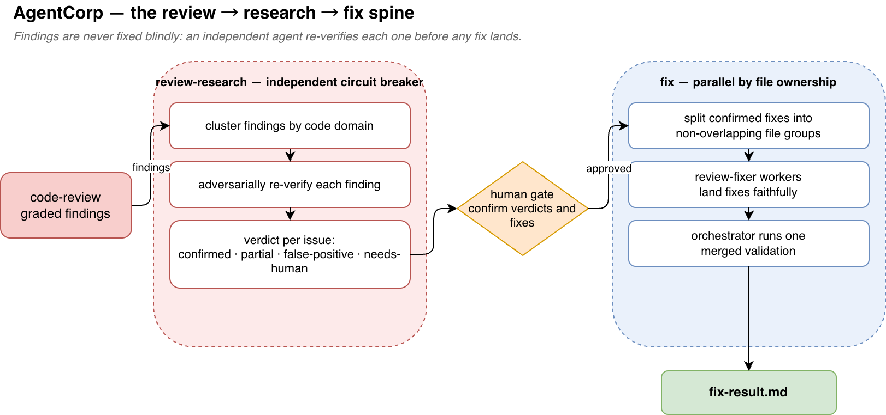
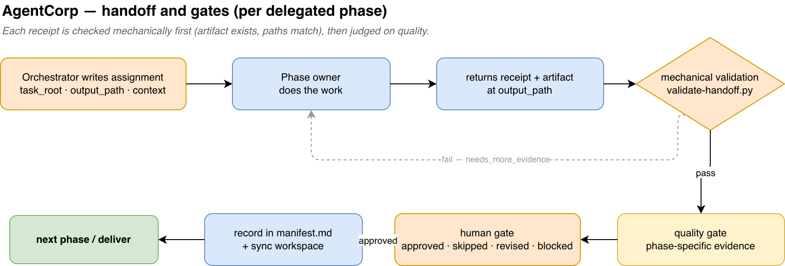

# AgentCorp

**English** | [中文](README_CN.md)

A multi-agent software-delivery pipeline, packaged as **Agent Skills**. A Delivery
Orchestrator classifies a task and routes each phase to a specialized role —
planning, implementation, multiple *independent* code reviewers, and layered
verification — with explicit gates between phases.

The suite uses the [Agent Skills](https://agentskills.io) `SKILL.md` standard, so the
same skills install in both **Claude Code** and **Codex** from this one repository.

## Workflow

AgentCorp models a delivery *organization*, not a single prompt. The Delivery
Orchestrator classifies each task into one of four paradigms —
`dev/architecture-first`, `enhancement/delta-design`, `bugfix/hypothesis-driven`, or
`addition/simple` — then drives it through a phased lifecycle in which the author of
an artifact never approves it.

### 1. Delivery lifecycle

Every paradigm runs a subset of the same phases. Review phases (red) and the human
gate (yellow) sit between work phases; `request changes` / `reject` loop back.



### 2. Roles

Specialized skills own each phase. Review roles stay independent from the work they
judge; the orchestrator never approves its own output.



### 3. The review → research → fix spine

AgentCorp's signature: code-review findings are never fixed blindly. An independent
`review-researcher` re-verifies each finding — a circuit breaker that kills false
positives — before any fix lands. Fixes then run in parallel, split by file ownership
so no two workers touch the same file.



### 4. Handoff & gates

Delegated phases move over assignment/receipt files. Each receipt is first checked
*mechanically* (does the artifact exist; do paths / author / phase match) and only
then judged against the phase's *quality gate* — the two are kept separate.



### Workflow modes

| Mode | Default | How it runs | When |
|------|---------|-------------|------|
| `single-agent` | yes | Orchestrator runs non-review phases itself; reviews are still delegated | regular / small–medium tasks — and the only mode on Codex |
| `subagents` | no | Every phase is delegated to its owner via assignment/receipt | large or parallel work, or when independent authorship is needed (Claude Code only) |

## Install — Claude Code

```
/plugin marketplace add ylxmf2005/AgentCorp
/plugin install agentcorp@agentcorp
```

Then `/reload-plugins` (or restart Claude Code). Skills are namespaced under the
plugin, e.g. `/agentcorp:delivery-orchestrator`, `/agentcorp:code-review-lead`.

## Install — Codex

**Whole suite (plugin):**

```
codex plugin marketplace add ylxmf2005/AgentCorp
```

Then launch Codex, enable **AgentCorp** from the `/plugins` menu, and restart so the
skills load.

**Individual skills (lighter, no plugin):** inside Codex, ask the built-in
installer, e.g.

```
use skill-installer to install the skill at repo ylxmf2005/AgentCorp path agentcorp/delivery-orchestrator
```

This lands the skill in `~/.codex/skills/`.

### Codex note: single-agent workflow

Codex has no subagents. The orchestrator **defaults to single-agent workflow** — it
runs each non-review phase itself while still delegating reviews to independent
review roles — so the suite works on Codex out of the box. The **subagents
workflow** (parallel fan-out to dispatched agents) is a Claude Code-only
enhancement and is simply unavailable on Codex.

## What's inside

26 skills covering the full pipeline:

- **Orchestration** — `delivery-orchestrator`
- **Planning & design** — `solution-architect`, `implementation-planner`, `test-planner`, `sota-researcher`
- **Implementation** — `implementation-engineer`, `review-fixer`
- **Plan / test-plan review** — `plan-review-lead`, `test-plan-reviewer`, `adversarial-reviewer`
- **Code review** — `code-review-lead` plus specialized reviewers: `correctness-reviewer`, `security-reviewer`, `performance-reviewer`, `reliability-reviewer`, `simplicity-reviewer`, `standards-reviewer`, `api-contract-reviewer`
- **Verification** — `test-leader`, `e2e-tester`, `api-contract-tester`, `regression-tester`
- **Review research & acceptance** — `review-researcher`, `acceptance-review-lead`
- **Support** — `change-detailed-walker`, `fresh-start-handoff`

Full per-skill descriptions live in each `agentcorp/<skill>/SKILL.md` and show up in
the Claude Code / Codex skill pickers.

## Layout & maintenance

| Path | Role |
|------|------|
| `agentcorp/<skill>/SKILL.md` | The skills — **single source**, shared by both tools |
| `.claude-plugin/plugin.json`, `.claude-plugin/marketplace.json` | Claude Code manifests — **canonical metadata** |
| `.codex-plugin/plugin.json`, `.agents/plugins/marketplace.json` | Codex manifests — **generated** |
| `tools/codex-interface.json` | Codex-only branding/policy (no Claude equivalent) |
| `tools/sync-codex.py` | Regenerates the Codex manifests from the Claude manifests |

Both ecosystems point their `skills` field at the same `./agentcorp` directory and
auto-discover the skill folders — there is no duplicated skill content. To change
metadata: edit the Claude manifests (and `tools/codex-interface.json` for Codex
branding), then run:

```
python3 tools/sync-codex.py
```
