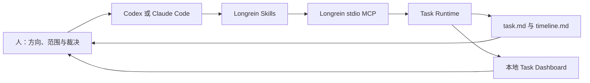

<div align="center">

# Longrein

**让强模型自主完成工程工作，把方向、边界与裁决留在人手里。**

Longrein 为 Codex 和 Claude Code 安装一组按需组合的工程 Skills、两段常驻协作规则，
以及用于持久任务状态的本地 MCP Runtime 与只读 Dashboard。

[快速开始](#快速开始) · [工作方式](#工作方式) · [Task Dashboard](#task-dashboard) · [文档](#文档)

</div>

## 快速开始

需要 Node.js 18 或更高版本：

```bash
npm install -g longrein
longrein install -y
longrein status
```

`longrein install -y` 会同时为 Codex 与 Claude Code：

- 安装 10 个工程 Skills；
- 同步 `job` 与 `soul` 两段常驻规则；
- 注册 Longrein stdio MCP。

只安装到一个宿主时使用 `--codex` 或 `--claude`。安装完成后重新打开宿主，使新 Skill 与 MCP 在新会话中生效。

开始一项需要跨 Session 保存状态的任务：

| Claude Code | Codex |
| --- | --- |
| `/task <你的请求>` | `$task <你的请求>` |

`task` 只在显式调用时启动。普通问答、小修和一次性调查不会被强制放进持久流程。

## 工作方式

Longrein 不是固定阶段的 Agent 编排器。Skills 根据当前工作缺少的能力按需组合；Task Runtime 只为显式启动的长期任务保存承诺、当前工作、产物、发现与完成证据。



| 组成 | 负责什么 | 不负责什么 |
| --- | --- | --- |
| Skills | 调查、塑形、实现、评审、测试与讲解的专业判断 | 不把所有任务塞进同一流程 |
| 常驻规则 | 约束证据、权限、范围与长期协作习惯 | 不保存具体任务事实 |
| MCP Runtime | 保存 Active Task 的唯一机器状态和语义检查点 | 不监听每次工具调用，不推断 Agent 没表达的想法 |
| Dashboard | 聚合、搜索和阅读已注册 Task | 不修改任务语义状态 |

Agent 只通过 Longrein MCP 读写 Task Runtime。MCP 不可用或调用失败时公开阻塞，不改用 shell，也不直接编辑 Runtime 拥有的文件。

## Task Dashboard

```bash
longrein dashboard
```

Dashboard 与 API 由同一个本地 Node 进程提供，只绑定 `127.0.0.1`，不需要 access token。它会聚合当前 Longrein Home 中已注册的 Task，默认打开浏览器，并每 5 秒刷新一次状态。

你可以在界面中：

- 按状态筛选或搜索全部 Task；
- 查看 Goal、Scope、Now / Next、完成证据、发现和 Timeline；
- 预览已登记的 Markdown、表格、代码块和 Mermaid 产物；
- 查看 Runtime 与 Registry 健康问题；
- 在 macOS 上把 Task workspace 或 repository 打开到 Finder、VS Code 或终端。

Dashboard 对 Task 数据保持只读。本机“打开路径”动作只接受已注册 Task 内的已知路径，并进行同源与目录边界检查。

完整说明见 [Task Dashboard](docs/dashboard.md)。

## MCP

Longrein 使用 stdio MCP。每个 Codex 或 Claude Code 宿主会话启动一次 `longrein mcp`，后续工具调用复用同一个 Node 进程；它不开放网络端口，也不依赖 Dashboard。

MCP 对 Agent 只暴露六个任务意图：

| Tool | 用途 |
| --- | --- |
| `longrein_task_read` | 列出、读取或检查 Task |
| `longrein_task_create` | 创建并注册 Task |
| `longrein_task_context` | 建立或修订 Task Context |
| `longrein_work_start` | 开始可恢复工作单元 |
| `longrein_checkpoint` | 汇总发现、产物、验证，并可 finish 或 block |
| `longrein_task_close` | complete、abandon 或 supersede |

安装与更新命令会自动维护 MCP 配置；人工检查时使用：

```bash
longrein mcp status
```

工具契约、失败恢复与幂等边界见 [MCP](docs/mcp.md)。

## 10 个 Skills

| Skill | 什么时候使用 |
| --- | --- |
| [`task`](skills/task/SKILL.md) | 显式开始、恢复或查看一项持久任务 |
| [`shape`](skills/shape/SKILL.md) | 方向、边界、根因、系统形态或实现路线还不可靠 |
| [`grill`](skills/grill/SKILL.md) | 对已有方向分轮追问，让隐含决定和薄弱假设显形 |
| [`dev`](skills/dev/SKILL.md) | 方向和关键结构明确后实现功能、修复缺陷或执行重构 |
| [`review`](skills/review/SKILL.md) | 审查 Phase 或完整交付中的代码、决定、文档与 Task 状态 |
| [`test`](skills/test/SKILL.md) | 制定 TestPlan、执行真实测试并交付 Test Report |
| [`walkthrough`](skills/walkthrough/SKILL.md) | 让没有读过对象的人真正理解并能够继续判断 |
| [`rewind`](skills/rewind/SKILL.md) | 错误前提已经污染当前时间线，需要恢复可信状态 |
| [`prompt`](skills/prompt/SKILL.md) | 仅在显式调用时，从真实任务中提炼更好的提示词 |
| [`evolution`](skills/evolution/SKILL.md) | 判断哪些可复用经验值得改变未来行为 |

Claude Code 使用 `/name` 显式调用，Codex 使用 `$name`。除 `task`、`prompt` 等明确要求手动调用的 Skill 外，宿主也可以根据 Skill 的 `description` 自动选择。

## 文档

| 文档 | 适合什么时候读 |
| --- | --- |
| [文档入口](docs/README.md) | 不确定该从哪里开始 |
| [安装与首次使用](docs/getting-started.md) | 安装、更新、验证或卸载 Longrein |
| [MCP](docs/mcp.md) | 理解 Agent 如何访问 Task Runtime |
| [Task Runtime](docs/task-runtime.md) | 理解状态、Registry、投影、完成门禁与恢复 |
| [Task Dashboard](docs/dashboard.md) | 使用前端、API、本机打开动作与安全边界 |
| [CLI](docs/cli.md) | 人工维护安装、MCP、Dashboard 或 Runtime |
| [Codex 推荐配置](docs/codex-recommended-setup.md) | 可选地配置 FastCtx、CodeGraph 与探索代理 |

README 只保留稳定入口与产品边界；详细协议只在对应专题文档维护，避免同一事实出现多个版本。

## 它不是什么

Longrein 不是 coding model、通用 Agent 执行 runtime，也不是固定阶段的交付编排器。它不会监控全部工具调用、自动扫描电脑寻找 Task，或让所有工作都产生持久产物。

Task Registry 只保存已注册 Task 的位置；Task 当前状态始终属于自己的 Runtime。旧 schema 不做兼容迁移，需要继续时创建新的 Runtime Task。

## 从源码开发

```bash
git clone https://github.com/ylxmf2005/LongRein.git
cd LongRein
npm install
npm run typecheck
npm test
npm run build
npm link
longrein install --link -y
```

修改 CLI、MCP 或 Dashboard 后运行：

```bash
npm run typecheck && npm test && npm run build && longrein doctor
```

问题与建议请提交到 [GitHub Issues](https://github.com/ylxmf2005/LongRein/issues)。

## License

MIT License
