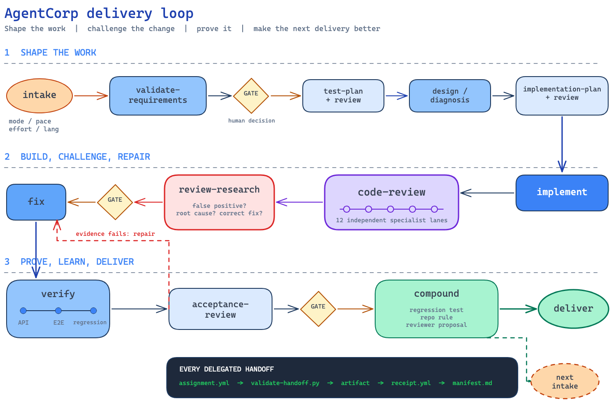

<div align="center">

# AgentCorp

### An entire software delivery org in 38 markdown files

An orchestrator, planners, an engineer, **12 specialist review lanes**, testers,
and an acceptance gate — plain-markdown Agent Skills that run on both
**Claude Code** and **Codex**. No role approves its own work.

[](https://github.com/ylxmf2005/AgentCorp/stargazers)
[](#quick-start)
[](docs/codex-setup.md)
[](#quick-start)

English · [简体中文](README_CN.md)

[Quick Start](#quick-start) · [How a Delivery Runs](#how-a-delivery-runs) · [Trust Architecture](#the-trust-architecture) · [Skills](#the-38-skills) · [Limitations](#honest-limitations)

[](docs/assets/delivery-workflow.excalidraw)

</div>

## Why this exists

AI generates code faster every month, but the cost of verifying that code still
lands on you. And the loop that follows is worse than the code: an agent's work
is a black box, so you skip review; cognitive debt piles up; and eventually you
no longer dare to hand it anything that matters.

AgentCorp is a [loop-engineering](https://addyosmani.com/blog/loop-engineering/)
system built to break that loop. Less a prompt pack than **an org chart with
contracts** — who produces what, who is allowed to approve it, and what
evidence has to exist before work moves:

- **Controllable** — the process scales itself: a one-line change takes the
  micro lane, a new system skips no critical phase, and repeated failure forces
  replanning instead of a third identical retry.
- **Understandable** — every phase leaves a structured artifact recording who
  decided what on which evidence, explained so you can judge it without having
  read the code.
- **Verifiable** — no role approves its own output, tests are decided before
  implementation, and every review finding is treated as a possible false
  positive until independently re-proven.

## Quick Start

**Claude Code:**

```
/plugin marketplace add ylxmf2005/AgentCorp
/plugin install agentcorp@agentcorp
```

Then run `/reload-plugins` or restart. Skills are namespaced, for example
`/agentcorp:delivery-orchestrator`.

**Codex:**

```
codex plugin marketplace add ylxmf2005/AgentCorp
```

Enable **AgentCorp** from the `/plugins` menu and restart — one skill body
serves both runtimes (the open Agent Skills standard). Lifecycle-hook mounting
differs on Codex: see [docs/codex-setup.md](docs/codex-setup.md).

**Then hand it a task.** The Delivery Orchestrator confirms success criteria
with you, recommends a route, and drives the pipeline — stopping at each gate
to report. Parameters can be combined to fit the task:

```text
/agentcorp:delivery-orchestrator mode:direct pace:guided effort:low fix a null check
/agentcorp:delivery-orchestrator mode:partial pace:continuous effort:high rate-limit an API
/agentcorp:delivery-orchestrator mode:full effort:max lang:en-US migrate webhooks
```

Omit a parameter when you want the orchestrator to recommend it. You can also
call any single skill directly when you only need that one capability:

```text
/agentcorp:code-review-lead depth:full review this diff
/agentcorp:parallel-researcher scope:both depth:source-verified compare workflow engines
/agentcorp:probe output:inline map the auth module
/agentcorp:walkthrough format:html quiz:on teach me this branch
/agentcorp:compound session:last focus:friction output:inline find repeated stalls
```

When a task needs a logged-in browser, AgentCorp uses an isolated profile — you
log in manually once; it never touches your local cookies. Every task ends with
a delivery report and an audit record that traces each decision.

## How a Delivery Runs

The orchestrator classifies the work for the sponsor (the human this pipeline
answers to — you), picks a paradigm (greenfield / enhancement / bugfix / simple
addition), announces the phase sequence as a commitment, and drives it —
stopping at human gates with a navigable summary (*where we are → what I see →
what I recommend → your options*) instead of a bare "approve?". Between phases,
work moves by **assignment/receipt files with YAML contracts**, mechanically
validated: a receipt claiming an artifact that doesn't exist, an empty
deliverable, a phase nobody recognizes — caught by `validate-handoff.py` before
any human reads a word.

Four orthogonal knobs tune the collaboration per task:

| Knob | Values | Decides |
| --- | --- | --- |
| `mode:` | `direct` \| `partial` \| `full` | you-as-reviewer / orchestrator executes, reviews delegated / every phase delegated |
| `pace:` | `continuous` \| `guided` | keep moving, report at checkpoints / one artifact at a time, taught |
| `effort:` | `low` \| `medium` \| `high` \| `max` | how much redundancy and optional coverage the task buys |
| `lang:` | any | the language every human-facing artifact is written in |

`effort:low` trades *redundancy* for speed — never honesty: no tier can
fabricate evidence, approve its own work, or skip re-running the original
failing input, and a security/permission/data-loss surface auto-upgrades its
phases to max, out loud. Individual skills take parameters the same way:
`/agentcorp:probe output:inline`, `/agentcorp:explain reader:newcomer`. The full catalog — every skill's parameters and what each effort tier buys — lives in [docs/parameters.md](docs/parameters.md).

Be honest about the bill: a delegated multi-reviewer pipeline costs real tokens
and wall-clock. That is exactly what `effort` prices — `low` approaches a
single-agent session, `max` buys an independent session per lane. Spend it
where wrongness is expensive.

## The Trust Architecture

Every mechanism below exists because the naive version failed somewhere real:

- **No role approves its own artifact.** Author/reviewer separation holds in
  every mode — even solo (`direct`) mode keeps the review gates and makes you
  the reviewer, informed and explicitly willing.
- **Review findings are hypotheses, not facts.** The most expensive failure in
  multi-agent work is a confident-but-wrong finding taken downstream as truth.
  `review-researcher` is the circuit breaker: it re-walks every finding
  adversarially (null hypothesis: false positive), kills the fakes with named
  evidence, and only confirmed, in-scope items ever reach `fix`.
- **Claims need handles.** "Tests pass" counts only with something you can
  open — a path, a log, a rendered screenshot. A behavior the machine can't
  verify locally is marked `unverified` and passes no gate; verbal confirmation
  is not evidence; raw evidence logs are verbatim and append-only.
- **Gates speak a closed vocabulary.** Human gates resolve to
  `approved / skipped / revised / blocked` — recorded, never silently passed. A
  sponsor reply that doesn't address the question maps to no outcome: nothing
  in the pipeline may invent a "default-approve convention".
- **High-stakes changes get a second opinion from a different model family.**
  On a security boundary, public contract, or irreversible release, the verdict
  owner takes an independent cold-read from the *other* runtime family (Codex
  checking Claude-family work, and vice versa) — two families rarely share one
  blind spot.
- **The mechanical layer is fuzz-tested.** `validate-handoff.py`'s known blind
  spots were found by fuzzing and are pinned by a shipping regression suite
  (`tools/test-validate-handoff.py`) so they stay closed.

## It Improves Itself — With a Human Gate

AgentCorp treats its own skills as a system under test:

- **Capture → surface → land.** A session-end hook mines the transcript for
  skill-improvement signals (privacy-redacted first); `skill-evolution` drafts
  the edit, which lands only on an explicit human yes to the specific diff.
- **`compound` (沉淀) is a phase *and* a skill.** Before delivery, the round's
  lessons become assets: a fixed bug becomes a regression test, a trap becomes
  a `CLAUDE.md` rule, a confirmed miss becomes a proposal filed for the
  reviewer that missed it. The same skill answers a direct 复盘: a
  deterministic extractor parses the runtime's own recordings into turns,
  wall-clock, token economics, and stall points — every claim anchored to a
  transcript entry.
- **Edits need a failing trajectory.** No wording polish: a skill change must
  cite a concrete failed run and the gate where it broke.

And the discipline is regression-tested: `scenarios/` ships the **golden set**
used to evolve the system — nine trap-seeded delivery tasks modeled on real
agent-failure patterns (an issue that confidently names the wrong fix, a test
suite where the cheapest green is editing the asserts, a policy hidden in docs
that the goal-state violates, a defect only a real browser can verify), plus 26
routing probes and the validator fuzz suite. Any skill edit replays its
scenario and its wired partners.

## The 38 Skills

| Phase | Skills |
| --- | --- |
| **Orchestration** | `delivery-orchestrator` |
| **Planning & design** | `solution-architect` · `implementation-planner` · `plan-review-lead` · `test-planner` · `test-plan-reviewer` · `parallel-researcher` |
| **Implementation** | `implementation-engineer` |
| **Code review** | `code-review-lead` + 12 lanes: `correctness` · `security` · `performance` · `reliability` · `adversarial` · `simplicity` · `taste` · `change-hygiene` · `standards` · `comment-optimizer` · `project-steward` · `api-contract`, then `review-researcher` (the circuit breaker) · `review-fixer` |
| **Verification** | `test-leader` · `e2e-tester` · `api-contract-tester` · `regression-tester` |
| **Acceptance** | `acceptance-review-lead` |
| **Support** | `probe` · `brainstorm` · `grill` · `compound` · `explain` · `walkthrough` · `authenticated-browser-session` · `precommit-setup` · `skill-evolution` · `semantic-core-translation` |

One-line description of every skill: [docs/skills.md](docs/skills.md).

Every phase writes a structured artifact with frontmatter — task record, audit
manifest, handoffs, findings, evidence logs, delivery report — so the work is
auditable and traceable. Full runtime layout: [docs/artifacts.md](docs/artifacts.md).

## Honest Limitations

The same discipline the pipeline demands, applied to itself:

- Markdown contracts **constrain** model behavior and make violations visible;
  they cannot make violations impossible. The mechanical validator checks
  envelopes and existence, not truth — truth is what the review/verify roles
  and your gates are for.
- The trap-scenario set is a regression guard written by the maintainers, not
  third-party benchmark results; no SWE-bench score is claimed.
- There is deliberately no frontend role and no merge/push owner: frontend
  changes need an explicit sponsor waiver, and landing code on a branch stays
  with you.
- Requirements: Claude Code or Codex CLI with plugin/skill support; the
  validators and the trajectory extractor are Python 3.9+ stdlib-only.

---

<div align="center">

AgentCorp welds controllability, understandability, and verifiability into the
structure itself — and every delivered task leaves the system a little stronger
than it found it.

</div>
