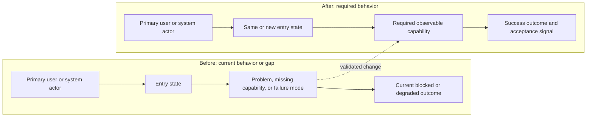
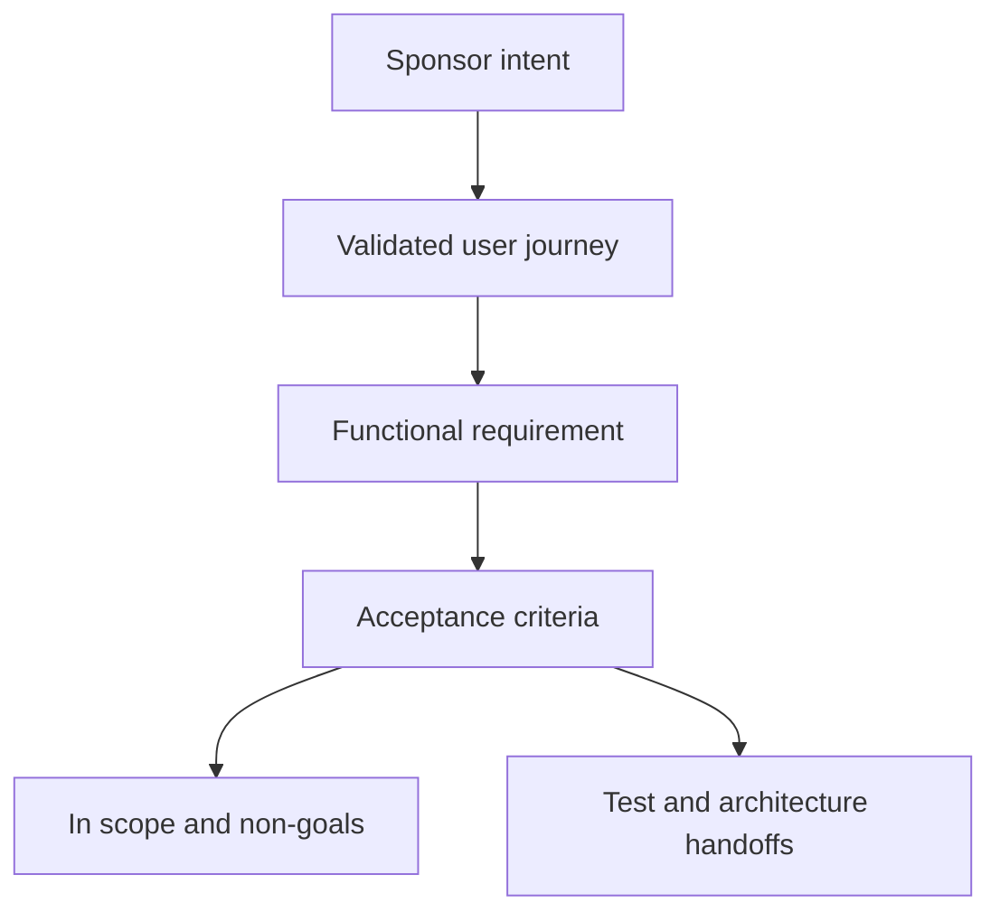

# Validated Requirements: Example Title

## Sponsor Intent

- Product-level intent; preserve important sponsor wording.

## Problem

- The current user or system problem, without presupposing an implementation.

## Target Users

- The primary user or system actor, and the job to be done.

## User Journeys

### UJ-1: Example journey

- Persona and context:
- Entry state:
- Path:
- Success condition:
- Edge cases:

## Glossary

- **Term** - A definition used consistently downstream.

## Functional Requirements

### FR-1: Capability name

The system must provide an observable capability.

Acceptance criteria:

- AC-1: Observable condition.

Source: sponsor request or source artifact.

## Non-Goals

- Behavior or scope explicitly excluded.

## MVP Scope

- In scope:
- Out of scope:

## Constraints

- Constraints provided by the sponsor.

## Success Criteria

- Conditions that prove the requirement is met.

## Assumptions

- Assumptions to be confirmed or validated downstream.

## Open Questions

- Q-1: Write "None" if there are none.

## Handoff to Test Planner

- Behaviors that must be proven:
- User journeys that need E2E coverage:
- Risk areas that need explicit testing:

## Handoff to Solution Architect

- Product constraints that must be preserved:
- Terminology and boundaries the architecture must carry over:
- Technical questions raised by the requirements:

## Mermaid Validation

- Which diagrams are included and why:
- Declarations checked:
- Task-specific labels checked:
- Example placeholders replaced:
- journey/scope/state labels describe observable behavior:
- Edge syntax checked:
- Human readability checked:
